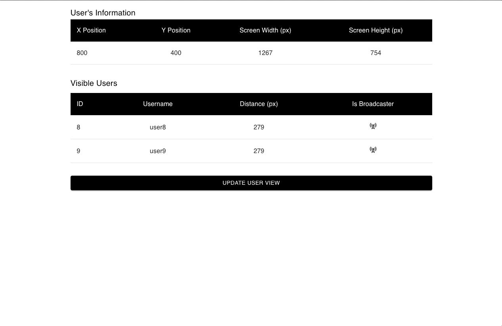

<p align="center">
    
</p>

## Overview

The Topia Frontend Challenge is a responsive React application designed to list all visible peer avatars that are entirely
within a user's screen. A user's screen is defined by the user's position and screen dimensions.

## Technology

- 
- 

## Getting Started

### Prerequisites

- yarn/npm

### Installation

```sh
git clone https://github.com/klam2k20/topia-frontend-challenge.git

# Install dependencies
npm install

# Start the application
npm start
```
